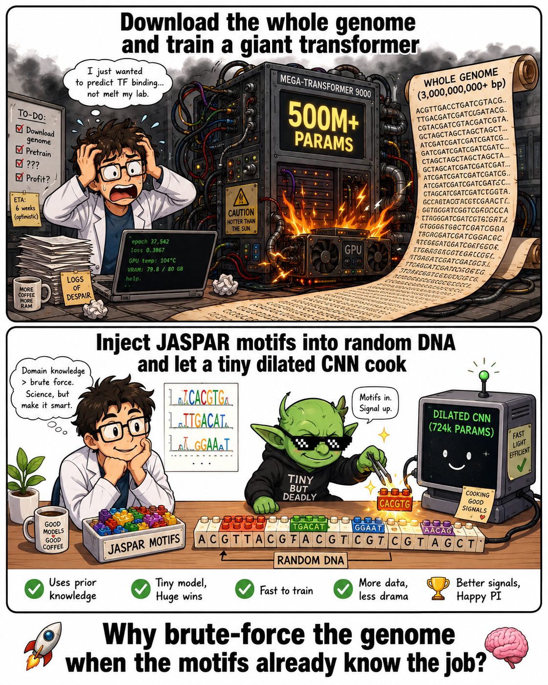

# Scaffold



Lightweight dilated CNN for genomic sequence classification with self-supervised pretraining on synthetic JASPAR motif sequences.

## Overview

Scaffold applies the self-supervised pretraining framework from [ChromaDCNN](https://github.com/woodRock/chroma-dcnn) to DNA sequence classification. The key idea: rather than pretraining on raw genome text (as DNABERT and Nucleotide Transformer do), we pretrain on synthetic sequences generated by injecting known transcription factor binding motifs from the [JASPAR2024](https://jaspar.elixir.no) database into random DNA backgrounds. This encodes domain knowledge about regulatory sequence structure before the model sees a single labelled example.

The architecture is a 724k-parameter 1D dilated ResNet — over 150× smaller than DNABERT (110M parameters) — evaluated on the `human_nontata_promoters` task from [Genomic Benchmarks](https://github.com/ML-Bioinfo-CEITEC/genomic_benchmarks).

### Analogy to ChromaDCNN

| ChromaDCNN (GC-MS) | Scaffold (DNA) |
|---|---|
| MoNA/MassBank EI-MS spectra | JASPAR2024 PWMs |
| Synthetic chromatogram generation | Synthetic motif injection |
| Next-frame prediction (causal) | Masked nucleotide prediction |
| `spec_proj: Linear(1000 → 128)` | `nuc_proj: Linear(4 → 128)` |
| 200 RT bins | 251 bp sequences |
| 4-class species classification | Binary promoter classification |

## Architecture

```
Input [B, 251, 4]  one-hot DNA
    │
    ▼
nuc_proj  Linear(4 → 128)          per-position nucleotide encoder
    │
    ▼
ResBlock  dilation=1  RF=7 bp
ResBlock  dilation=2  RF=19 bp
ResBlock  dilation=4  RF=43 bp
    │
    ├──── Global max-pool  [B, 128]
    │
    └──── Soft attention-pool  [B, 128]
                │
                ▼
            concat  [B, 256]
                │
                ▼
            Linear(256 → 2)
```

## Installation

```bash
git clone https://github.com/woodRock/scaffold.git
cd scaffold
pip install -e .
```

## Usage

### 1. Download JASPAR pretraining library

```bash
python scripts/01_download_pretrain_data.py
```

Downloads 879 vertebrate transcription factor PWMs from JASPAR2024 (~268 KB, seconds).

### 2. Inspect PWMs (optional)

```bash
python scripts/02_preprocess_pretrain_data.py
```

### 3. Pretrain on synthetic sequences

```bash
python scripts/03_pretrain_genomics.py
# ~5 minutes on a modern GPU
```

Trains a masked nucleotide predictor on JASPAR-seeded synthetic sequences.
Checkpoint saved to `checkpoints/best.pt`.

### 4. Fine-tune and evaluate

```bash
python scripts/04_finetune_evaluate.py
```

Evaluates two conditions via 10-seed × 5-fold cross-validation:
- `from_scratch` — random initialisation
- `genomics_pretrain` — weights initialised from step 3

Results saved to `results/promoters_results_lf1p00.json`.

#### Low-label ablation

```bash
python scripts/04_finetune_evaluate.py --label_fraction 0.01
python scripts/04_finetune_evaluate.py --label_fraction 0.05
python scripts/04_finetune_evaluate.py --label_fraction 0.10
python scripts/04_finetune_evaluate.py --label_fraction 0.25
python scripts/04_finetune_evaluate.py --label_fraction 0.50
python scripts/04_finetune_evaluate.py --label_fraction 1.00
```

`--label_fraction` subsamples the training split of each fold only; the validation split is always the full held-out fold so metrics are comparable across fractions.

### 5. Run baselines

```bash
python scripts/05_run_baselines.py
```

Evaluates k-mer frequency features (k=3,4,6) and flattened one-hot with RF, SVM, MLP, and logistic regression under the same CV protocol.

## Configuration

| File | Purpose |
|---|---|
| `configs/pretrain.yaml` | Pretraining hyperparameters |
| `configs/finetune_promoters.yaml` | Fine-tuning hyperparameters and CV protocol |

## Cluster usage

On shared GPU clusters where `$HOME` is NFS-mounted, set `GENOMIC_CACHE_DIR` to a shared persistent path to avoid re-downloading the dataset on each node:

```bash
export GENOMIC_CACHE_DIR=/path/to/shared/storage/genomic_benchmarks
python scripts/04_finetune_evaluate.py
```

## Prior work

The field is dominated by transformer-based masked language models: DNABERT (110M params), Nucleotide Transformer (500M–2.5B), and HyenaDNA. CNN-based self-supervised pretraining for short regulatory sequences (~250 bp) is sparsely covered. The closest work is DNASimCLR (contrastive CNN, microbial sequences) and a circular dilated CNN with self-supervised pretraining (Ng et al. 2023). Scaffold's contribution is JASPAR motif-seeded synthetic pretraining as a lightweight, domain-specific alternative to genome-wide masked LM — achieving competitive performance at a fraction of the parameter count and without requiring a genome download.

## Citation

```bibtex
@software{scaffold2026,
  author  = {Wood, Jesse},
  title   = {Scaffold: Self-Supervised Pretraining for DNA Sequence Classification},
  year    = {2026},
  url     = {https://github.com/woodRock/scaffold}
}
```
